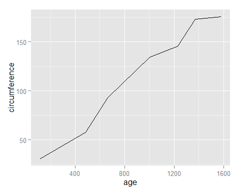
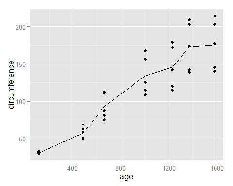
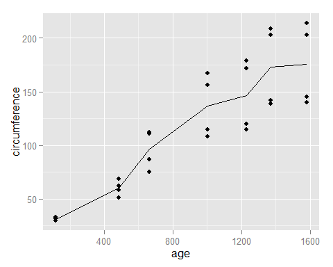
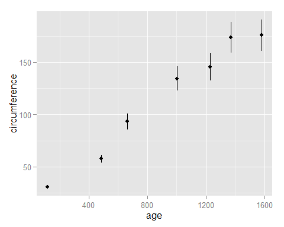
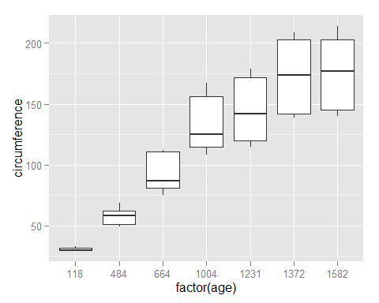
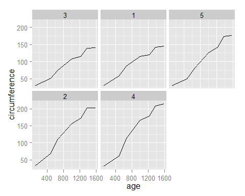

*This is an R Markdown document. Markdown is a simple formatting syntax for authoring HTML, PDF, and MS Word documents. For more details on using R Markdown see <http://rmarkdown.rstudio.com>.*

* * * * *

``` {.r}
library("ggplot2")
library("reshape2")
options(width = 85)
load("Affect.Rdata")
```

Plotting with ggplot2
---------------------

``` {.r}
# Lines and points
ggplot(Orange, aes(x = age, y = circumference, color = Tree)) + 
  geom_point() + geom_line()
```


``` {.r}
# Black and white version
ggplot(Orange, aes(x = age, y = circumference, shape = Tree, linetype = Tree)) + 
  geom_point() + geom_line()
```


``` {.r}
# Compute summary on-the-fly
ggplot(Orange, aes(x = age, y = circumference)) + 
  stat_summary(fun.y = mean, geom = "line") 
```



``` {.r}
# Modify last plot
last_plot() + geom_point()
```



``` {.r}
# Exclude cases on-the-fly
ggplot(subset(Orange, Tree != "5"), aes(age, circumference)) + 
  stat_summary(fun.y = mean, geom = "line") + geom_point()
```



``` {.r}
# other summary statistics
ggplot(Orange, aes(age, circumference)) + 
  stat_summary(fun.data = mean_se, geom = "pointrange")
```



``` {.r}
# show distribution information
ggplot(Orange, aes(factor(age), circumference)) + geom_boxplot()
```



``` {.r}
ggplot(Orange, aes(factor(age), circumference)) + geom_violin()
```


``` {.r}
# customizing graphs for publication
ggplot(Orange, aes(age, circumference)) + 
  stat_summary(fun.data = mean_se, geom = "pointrange") + 
  theme_bw(base_size = 12) + 
  labs(x = "Age in days", y = "Size")
```


``` {.r}
# "small multiples", aka facets
ggplot(Orange, aes(age, circumference)) + 
  facet_wrap(~ Tree) + geom_line()
```



``` {.r}
ggplot(Orange, aes(age, circumference)) + 
  facet_wrap(~ Tree, ncol = 1) + geom_line()
```


Formatting data for plotting and GCA
------------------------------------

**Example:** How negative affect is influenced by different 9-minute film exerpts (from `psych` package).

``` {.r}
summary(affect.subset)
```

    ##   Study          Film         NA1             NA2       
    ##  maps:160   Sad    :83   Min.   : 0.00   Min.   : 0.00  
    ##  flat:170   Threat :78   1st Qu.: 1.00   1st Qu.: 0.00  
    ##             Neutral:85   Median : 2.00   Median : 3.00  
    ##             Happy  :84   Mean   : 3.69   Mean   : 4.65  
    ##                          3rd Qu.: 6.00   3rd Qu.: 7.00  
    ##                          Max.   :28.00   Max.   :30.00

``` {.r}
head(affect.subset)
```

    ##   Study    Film NA1 NA2
    ## 1  maps Neutral   2   4
    ## 2  maps Neutral   4   5
    ## 3  maps Neutral   2   1
    ## 4  maps Neutral   0   2
    ## 5  maps Neutral  13  13
    ## 6  maps     Sad   1   2

This is "wide" data; there are multiple observations in a row of data. We convert to "long" data using `melt`. Long data has one observation per row.

``` {.r}
# Add a subject number.
affect.subset$SubjNum <- seq_len(nrow(affect.subset))
ids <-  c("SubjNum", "Study", "Film")
measures <- c("NA1", "NA2")
affect.m <- melt(affect.subset, id.vars = ids, measure.vars = measures)
summary(affect.m)
```

    ##     SubjNum     Study          Film     variable      value      
    ##  Min.   :  1   maps:320   Sad    :166   NA1:330   Min.   : 0.00  
    ##  1st Qu.: 83   flat:340   Threat :156   NA2:330   1st Qu.: 0.00  
    ##  Median :166              Neutral:170             Median : 2.00  
    ##  Mean   :166              Happy  :168             Mean   : 4.17  
    ##  3rd Qu.:248                                      3rd Qu.: 6.00  
    ##  Max.   :330                                      Max.   :30.00

``` {.r}
# Default columns names are not very informative, so customize them:
affect.m <- melt(affect.subset, id.vars = ids, measure.vars = measures, 
                 variable.name = "TestTime", value.name = "NegAffect")
summary(affect.m)
```

    ##     SubjNum     Study          Film     TestTime    NegAffect    
    ##  Min.   :  1   maps:320   Sad    :166   NA1:330   Min.   : 0.00  
    ##  1st Qu.: 83   flat:340   Threat :156   NA2:330   1st Qu.: 0.00  
    ##  Median :166              Neutral:170             Median : 2.00  
    ##  Mean   :166              Happy  :168             Mean   : 4.17  
    ##  3rd Qu.:248                                      3rd Qu.: 6.00  
    ##  Max.   :330                                      Max.   :30.00

Now we can use `ggplot2`.

``` {.r}
ggplot(affect.m, aes(Film, NegAffect, fill = TestTime)) + geom_boxplot()
```


`dcast` function converts a molten (`melt`-ed) data-frame from long to wide format. This function is useful for aggregating data and making summary tables.

``` {.r}
dcast(affect.m, Film ~ TestTime, value.var = "NegAffect", fun.aggregate = mean)
```

    ##      Film   NA1   NA2
    ## 1     Sad 3.504 8.666
    ## 2  Threat 3.364 5.372
    ## 3 Neutral 3.921 2.894
    ## 4   Happy 3.956 1.786

### Further reading

-   Hadley Wickham's [Tidy Data](http://vita.had.co.nz/papers/tidy-data.html) describes the framework for the `reshape2` package.

* * * * *

``` {.r}
sessionInfo()
```

    ## R version 3.1.0 (2014-04-10)
    ## Platform: x86_64-w64-mingw32/x64 (64-bit)
    ## 
    ## locale:
    ## [1] LC_COLLATE=English_United States.1252  LC_CTYPE=English_United States.1252   
    ## [3] LC_MONETARY=English_United States.1252 LC_NUMERIC=C                          
    ## [5] LC_TIME=English_United States.1252    
    ## 
    ## attached base packages:
    ## [1] splines   stats     graphics  grDevices utils     datasets  methods   base     
    ## 
    ## other attached packages:
    ##  [1] rmarkdown_0.2.46  reshape2_1.4      multcomp_1.3-3    TH.data_1.0-3    
    ##  [5] survival_2.37-7   mvtnorm_0.9-99992 plyr_1.8.1        lme4_1.1-6       
    ##  [9] Rcpp_0.11.2       Matrix_1.1-3      ggplot2_1.0.0    
    ## 
    ## loaded via a namespace (and not attached):
    ##  [1] colorspace_1.2-4    digest_0.6.4        evaluate_0.5.5      formatR_0.10       
    ##  [5] grid_3.1.0          gtable_0.1.2        htmltools_0.2.4     knitr_1.6          
    ##  [9] labeling_0.2        lattice_0.20-29     MASS_7.3-31         minqa_1.2.3        
    ## [13] munsell_0.4.2       nlme_3.1-117        proto_0.3-10        RcppEigen_0.3.2.1.2
    ## [17] sandwich_2.3-0      scales_0.2.4        stringr_0.6.2       tools_3.1.0        
    ## [21] yaml_2.1.13         zoo_1.7-11
