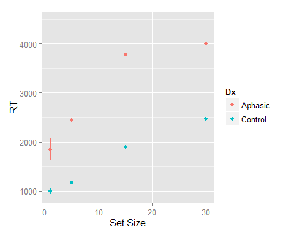
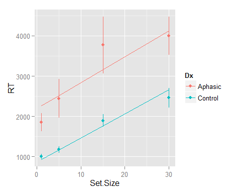
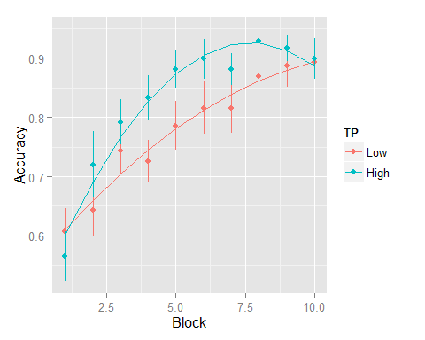
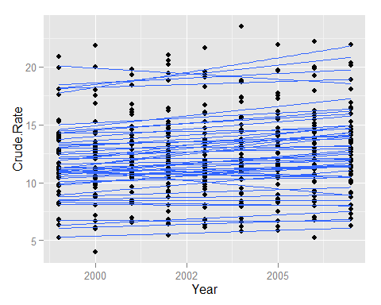
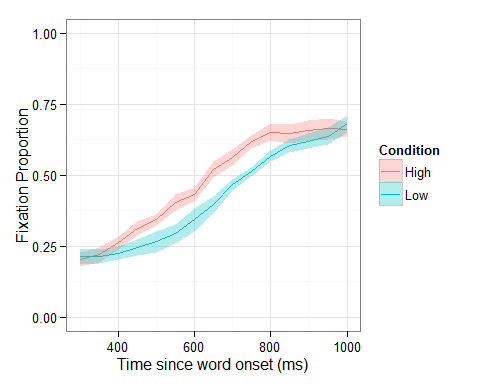

*This is an R Markdown document. Markdown is a simple formatting syntax for authoring HTML, PDF, and MS Word documents. For more details on using R Markdown see <http://rmarkdown.rstudio.com>.*

* * * * *

``` {.r}
library("ggplot2")
library("lme4")
library("plyr")
library("reshape2")
options(width = 85)
load("Affect.Rdata")
load("Examples.Rdata")
```

Preliminaries
-------------

What are time course data? Observations from different points in time are nested within subjects.

Some challenges of analyzing time course data:

-   Two growth curves (e.g., from different experimental conditions) can be significantly different, but traditional t-tests won't detect this gradual changes over time.
-   Unpredicted crossover effects where one growth curve reliably crosses over another curve. You want to avoid hand-selecting where the crossover might occur. GCA lets you look at the whole curve.

Conceptual overview of GCA
--------------------------

Observed value y is the predicted value b0 + b1X (from the fixed effects) plus the error. In multilevel data, there are multiple observations for a subject. Each subject has a level-1 regression model. The level-2 regression model estimates the level-1 regression parameters (each subject's intercepts and slopes.

### Fixed versus random effects

Fixed effects are the things that are interesting and reproducible properties of the world. As Mirman says on [his blog](http://mindingthebrain.blogspot.com/2012/08/treating-participants-or-items-as.html):

> **Fixed effects** are the effects that we imagine to be constant in the population or group under study. As such, when we conduct a study, we would like to conclude that the observed fixed effects generalize to the whole population. So if I've run a word recognition study and found that uncommon (low frequency) words are processed slower than common (high frequency) words, I would like to conclude that this difference is true of all typical adults (or at least WEIRD adults: Henrich, Heine, & Norenzayan, 2010).

> **Random effects** are the differences among the individual observational units in the sample, which we imagine are randomly sampled from the population. As such, these effects should conform to a specified distribution (typically a normal distribution) and have a mean of 0. So in my word recognition experiment, some participants showed large a word frequency effect and some showed a small effect, but I am going to assume that these differences reflect random, normally-distributed variability in the population.

> Statistically, the difference is that fixed effect parameters are estimated independently and not constrained by a distribution. So, in the example, estimated recognition time for low and high frequency conditions can have whatever values best describe the data. Random effects are constrained to have a mean of 0 and follow a normal distribution, so estimated recognition time for a particular participant (or item, in a by-items analysis) reflects the recognition time for that individual as well as the pattern of recognition times across all other individuals in the sample. The consequence is that random effect estimates tend to be pulled toward their mean, which is called "shrinkage". So the trade-off is between independent estimation (fixed effects) and generalization (random effects).

### Maximum likelihood estimation

This is not error minimization (i.e., least squares estimation). There is not a closed-form solution for multilevel data. The modeling processing has to iteratively find the set of parameter estimates that maximizes the likelihood of the data. You compare models on the basis of likelihood comparison tests.

Simple linear GCA example
-------------------------

Look at the visual search data.

``` {.r}
summary(VisualSearchEx)
```

    ##   Participant        Dx        Set.Size          RT       
    ##  0042   :  4   Aphasic:60   Min.   : 1.0   Min.   :  414  
    ##  0044   :  4   Control:72   1st Qu.: 4.0   1st Qu.: 1132  
    ##  0083   :  4                Median :10.0   Median : 1814  
    ##  0166   :  4                Mean   :12.8   Mean   : 2261  
    ##  0186   :  4                3rd Qu.:18.8   3rd Qu.: 2808  
    ##  0190   :  4                Max.   :30.0   Max.   :12201  
    ##  (Other):108

``` {.r}
ggplot(VisualSearchEx, aes(Set.Size, RT, color = Dx)) + 
  stat_summary(fun.data = mean_se, geom = "pointrange")
```



``` {.r}
# fit a base model
vs.null <- lmer(RT ~ 1 + (Set.Size | Participant), 
                data = VisualSearchEx, REML = FALSE)
# add effect of set size
vs <- lmer(RT ~ Set.Size + (Set.Size | Participant), 
           data = VisualSearchEx, REML = FALSE)
# Or:
vs <- update(vs.null, . ~ . + Set.Size)
# add effect of diagnosis
vs.0 <- update(vs.null, . ~ . + Set.Size + Dx)
# add interaction
vs.1 <- update(vs.null, . ~ . + Set.Size * Dx)
# compare models
anova(vs.null, vs, vs.0, vs.1)
```

    ## Data: VisualSearchEx
    ## Models:
    ## vs.null: RT ~ 1 + (Set.Size | Participant)
    ## vs: RT ~ (Set.Size | Participant) + Set.Size
    ## vs.0: RT ~ (Set.Size | Participant) + Set.Size + Dx
    ## vs.1: RT ~ (Set.Size | Participant) + Set.Size + Dx + Set.Size:Dx
    ##         Df  AIC  BIC logLik deviance Chisq Chi Df Pr(>Chisq)    
    ## vs.null  5 2283 2297  -1136     2273                            
    ## vs       6 2248 2265  -1118     2236 36.90      1    1.2e-09 ***
    ## vs.0     7 2241 2261  -1114     2227  8.58      1     0.0034 ** 
    ## vs.1     8 2241 2264  -1113     2225  2.01      1     0.1567    
    ## ---
    ## Signif. codes:  0 '***' 0.001 '**' 0.01 '*' 0.05 '.' 0.1 ' ' 1

``` {.r}
# Put all the model summaries together
stargazer::stargazer(vs.null, vs, vs.0, vs.1, type = "html", 
                     intercept.bottom = FALSE)
```

<table style="text-align:center"><tr><td colspan="5" style="border-bottom: 1px solid black"></td></tr><tr><td style="text-align:left"></td><td colspan="4">
<em>Dependent variable:</em>
</td></tr>
<tr><td></td><td colspan="4" style="border-bottom: 1px solid black"></td></tr>
<tr><td style="text-align:left"></td><td colspan="4">
RT
</td></tr>
<tr><td style="text-align:left"></td><td>
(1)
</td><td>
(2)
</td><td>
(3)
</td><td>
(4)
</td></tr>
<tr><td colspan="5" style="border-bottom: 1px solid black"></td></tr><tr><td style="text-align:left">
Constant
</td><td>
1,302.000<sup>\*\*\*</sup>
</td><td>
1,475.000<sup>\*\*\*</sup>
</td><td>
2,100.000<sup>\*\*\*</sup>
</td><td>
2,079.000<sup>\*\*\*</sup>
</td></tr>
<tr><td style="text-align:left"></td><td>
(197.700)
</td><td>
(202.300)
</td><td>
(262.700)
</td><td>
(264.400)
</td></tr>
<tr><td style="text-align:left"></td><td></td><td></td><td></td><td></td></tr>
<tr><td style="text-align:left">
Set.Size
</td><td></td><td>
61.640<sup>\*\*\*</sup>
</td><td>
61.640<sup>\*\*\*</sup>
</td><td>
73.490<sup>\*\*\*</sup>
</td></tr>
<tr><td style="text-align:left"></td><td></td><td>
(7.799)
</td><td>
(7.714)
</td><td>
(11.230)
</td></tr>
<tr><td style="text-align:left"></td><td></td><td></td><td></td><td></td></tr>
<tr><td style="text-align:left">
DxControl
</td><td></td><td></td><td>
-1,145.000<sup>\*\*\*</sup>
</td><td>
-1,106.000<sup>\*\*\*</sup>
</td></tr>
<tr><td style="text-align:left"></td><td></td><td></td><td>
(355.300)
</td><td>
(357.900)
</td></tr>
<tr><td style="text-align:left"></td><td></td><td></td><td></td><td></td></tr>
<tr><td style="text-align:left">
Set.Size:DxControl
</td><td></td><td></td><td></td><td>
-21.740
</td></tr>
<tr><td style="text-align:left"></td><td></td><td></td><td></td><td>
(15.200)
</td></tr>
<tr><td style="text-align:left"></td><td></td><td></td><td></td><td></td></tr>
<tr><td colspan="5" style="border-bottom: 1px solid black"></td></tr><tr><td style="text-align:left">
Observations
</td><td>
132
</td><td>
132
</td><td>
132
</td><td>
132
</td></tr>
<tr><td style="text-align:left">
Log Likelihood
</td><td>
-1,136.000
</td><td>
-1,118.000
</td><td>
-1,114.000
</td><td>
-1,113.000
</td></tr>
<tr><td style="text-align:left">
Akaike Inf. Crit.
</td><td>
2,283.000
</td><td>
2,248.000
</td><td>
2,241.000
</td><td>
2,241.000
</td></tr>
<tr><td style="text-align:left">
Bayesian Inf. Crit.
</td><td>
2,297.000
</td><td>
2,265.000
</td><td>
2,261.000
</td><td>
2,264.000
</td></tr>
<tr><td colspan="5" style="border-bottom: 1px solid black"></td></tr><tr><td style="text-align:left">
<em>Note:</em>
</td><td colspan="4" style="text-align:right">
<sup>*</sup>p\<0.1; <sup>**</sup>p\<0.05; <sup>***</sup>p\<0.01
</td></tr>
</table>
<br/>

Plot model fits.

``` {.r}
ggplot(VisualSearchEx, aes(Set.Size, RT, color = Dx)) + 
  stat_summary(fun.data = mean_se, geom = "pointrange") + 
  stat_summary(aes(y = fitted(vs.0)), fun.y = mean, geom = "line")
```



``` {.r}
# compare with full model fit
last_plot() + stat_summary(aes(y = fitted(vs.1)), fun.y = mean, 
                           geom = "line", linetype = "dashed")
```


* * * * *

Break
-----

``` {.r}
# Exercise 1: analyze the state-level suicide rate data from the WISQARS (wisqars.suicide)
#  did the regions differ in their baseline (1999) suicide rates?
#  did the regions differ in their rates of change of suidice rate?
#  plot observed data and model fits
```

* * * * *

Non-linear GCA: Conceptual Issues
---------------------------------

-   Choosing a functional form: adequacy, dynamic consistency, predictions
-   Natural and orthogonal polynomials

Dynamic consistency means that the model of the average equals the average of the models.

Polynomials are not naturally asymptotic; they don't hit plateaus. Mirman recommends trimming off most of the tail (plateau), but do trim on a principled basis. Polynomials are not great at making predictions. Statistical models (compact data summary) are different from comptuational models (forecasting, generating data).

Natural polynomials have the unfortunate property of being correlated: e.g., `Time` and `Time^2` are correlated. Orthogonal polynomials are recentered so that they are uncorrelated.

Don't double-dip. Don't look at the overal growth curve then test for an effect in the most interesting part of the growth curve. You're interesting experimenter bias.

### Non-linear GCA example

Effect of transitional probability on word-learning.

``` {.r}
summary(WordLearnEx)
```

    ##     Subject       TP          Block         Accuracy    
    ##  244    : 10   Low :280   Min.   : 1.0   Min.   :0.000  
    ##  253    : 10   High:280   1st Qu.: 3.0   1st Qu.:0.667  
    ##  302    : 10              Median : 5.5   Median :0.833  
    ##  303    : 10              Mean   : 5.5   Mean   :0.805  
    ##  305    : 10              3rd Qu.: 8.0   3rd Qu.:1.000  
    ##  306    : 10              Max.   :10.0   Max.   :1.000  
    ##  (Other):500

``` {.r}
ggplot(WordLearnEx, aes(Block, Accuracy, color = TP)) + 
  stat_summary(fun.data = mean_se, geom = "pointrange") + 
  stat_summary(fun.y = mean, geom = "line")
```


``` {.r}
# make orthogonal polynomial
t <- poly(1:10, 2)
# it can be a good idea to pull the range directly from your data set
t <- poly(1:max(WordLearnEx$Block), 2)
t
```

    ##              1        2
    ##  [1,] -0.49543  0.52223
    ##  [2,] -0.38534  0.17408
    ##  [3,] -0.27524 -0.08704
    ##  [4,] -0.16514 -0.26112
    ##  [5,] -0.05505 -0.34816
    ##  [6,]  0.05505 -0.34816
    ##  [7,]  0.16514 -0.26112
    ##  [8,]  0.27524 -0.08704
    ##  [9,]  0.38534  0.17408
    ## [10,]  0.49543  0.52223
    ## attr(,"degree")
    ## [1] 1 2
    ## attr(,"coefs")
    ## attr(,"coefs")$alpha
    ## [1] 5.5 5.5
    ## 
    ## attr(,"coefs")$norm2
    ## [1]   1.0  10.0  82.5 528.0
    ## 
    ## attr(,"class")
    ## [1] "poly"   "matrix"

I wrote a function to merge polynomial times into a dataframe...

``` {.r}
#' Compute orthogonal times
#' @param df a data-frame
#' @param degree degree of the desired polynomial
#' @param time_col the name of the column containing the time units
#' @return a data-frame with original time values and an ot column for
#'   each polynomial degree
orthogonal_time <- function(df, degree, time_col = "Time") {
  times <- df[[time_col]]
  clean_times <- sort(unique(times))
  time_df <- as.data.frame(poly(clean_times, degree))
  names(time_df) <- paste0("ot", names(time_df))
  time_df[[time_col]] <- clean_times
  time_df
}
orthogonal_time(WordLearnEx, 2, "Block")
```

    ##         ot1      ot2 Block
    ## 1  -0.49543  0.52223     1
    ## 2  -0.38534  0.17408     2
    ## 3  -0.27524 -0.08704     3
    ## 4  -0.16514 -0.26112     4
    ## 5  -0.05505 -0.34816     5
    ## 6   0.05505 -0.34816     6
    ## 7   0.16514 -0.26112     7
    ## 8   0.27524 -0.08704     8
    ## 9   0.38534  0.17408     9
    ## 10  0.49543  0.52223    10

``` {.r}
WordLearnEx <- merge(WordLearnEx, orthogonal_time(WordLearnEx, 2, "Block"))
# re-check data
summary(WordLearnEx)
```

    ##      Block         Subject       TP         Accuracy          ot1        
    ##  Min.   : 1.0   244    : 10   Low :280   Min.   :0.000   Min.   :-0.495  
    ##  1st Qu.: 3.0   253    : 10   High:280   1st Qu.:0.667   1st Qu.:-0.275  
    ##  Median : 5.5   302    : 10              Median :0.833   Median : 0.000  
    ##  Mean   : 5.5   303    : 10              Mean   :0.805   Mean   : 0.000  
    ##  3rd Qu.: 8.0   305    : 10              3rd Qu.:1.000   3rd Qu.: 0.275  
    ##  Max.   :10.0   306    : 10              Max.   :1.000   Max.   : 0.495  
    ##                 (Other):500                                              
    ##       ot2        
    ##  Min.   :-0.348  
    ##  1st Qu.:-0.261  
    ##  Median :-0.087  
    ##  Mean   : 0.000  
    ##  3rd Qu.: 0.174  
    ##  Max.   : 0.522  
    ## 

``` {.r}
# orthogonal polynomial time
ggplot(WordLearnEx, aes(Block, ot1)) + stat_summary(fun.y=mean, geom="line")
```


``` {.r}
last_plot() + stat_summary(aes(y=ot2), fun.y=mean, geom="line", color="red")
```


``` {.r}
# fit base model
m.base <- lmer(Accuracy ~ (ot1+ot2) + (ot1 + ot2 | Subject), data=WordLearnEx, REML=F)
# add effect of TP on intercept 
m.0 <- update(m.base, . ~ . + TP)
# add effect on slope
m.1 <- update(m.base, . ~ . + ot1*TP)
# add effect on quadratic
m.2 <- update(m.base, . ~ . + (ot1 + ot2)*TP)

# model comparisons
anova(m.base, m.0, m.1, m.2)
```

    ## Data: WordLearnEx
    ## Models:
    ## m.base: Accuracy ~ (ot1 + ot2) + (ot1 + ot2 | Subject)
    ## m.0: Accuracy ~ ot1 + ot2 + (ot1 + ot2 | Subject) + TP
    ## m.1: Accuracy ~ ot1 + ot2 + (ot1 + ot2 | Subject) + TP + ot1:TP
    ## m.2: Accuracy ~ ot1 + ot2 + (ot1 + ot2 | Subject) + TP + ot1:TP + 
    ## m.2:     ot2:TP
    ##        Df  AIC  BIC logLik deviance Chisq Chi Df Pr(>Chisq)  
    ## m.base 10 -331 -288    175     -351                          
    ## m.0    11 -330 -283    176     -352  1.55      1      0.213  
    ## m.1    12 -329 -277    176     -353  0.36      1      0.550  
    ## m.2    13 -333 -276    179     -359  5.95      1      0.015 *
    ## ---
    ## Signif. codes:  0 '***' 0.001 '**' 0.01 '*' 0.05 '.' 0.1 ' ' 1

``` {.r}
# plot model fit
ggplot(WordLearnEx, aes(Block, Accuracy, color = TP)) + 
  stat_summary(fun.data = mean_se, geom = "pointrange") + 
  stat_summary(aes(y = fitted(m.2)), fun.y = mean, geom = "line")
```



### Parameter estimates

See [his blog post, "Three ways to get parameter-specific p-values from lmer"](http://mindingthebrain.blogspot.com/2014/02/three-ways-to-get-parameter-specific-p.html):

> 1.  Use the normal approximation. Since the *t* distribution converges to the *z* distribution as degrees of freedom increase, this is like assuming infinite degrees of freedom. This is unambiguously anti-conservative, but for reasonable sample sizes, it appears not to be very anti-conservative (Barr et al., 2013). That is, if we take the *p*-value to measure the probability of a false positive, this approximation produces a somewhat (but perhaps not alarmingly) higher false positive rate than the nominal 5% at *p* = 0.05.
> 2.  Use the Satterthwaite approximation, which is implemented in the `lmerTest` package. According to the documentation, this is based on SAS proc mixed theory. The `lmerTest` package overloads the `lmer` function, so you can just re-fit the model using exactly the same code, but the `summary()` will now include approximate degrees of freedom and *p*-values. This implementation is extremely easy to use, but can be a little maddening if you forget whether your model is a an object of type `lmerMod` or `merModLmerTest`.
> 3.  Use the Kenward-Roger approximation to get approximate degrees of freedom and the *t*-distribution to get *p*-values, which is implemented in the `pbkrtest` package.

``` {.r}
summary(m.2)
```

    ## Linear mixed model fit by maximum likelihood  ['lmerMod']
    ## Formula: Accuracy ~ ot1 + ot2 + (ot1 + ot2 | Subject) + TP + ot1:TP +      ot2:TP
    ##    Data: WordLearnEx
    ## 
    ##      AIC      BIC   logLik deviance df.resid 
    ##   -332.6   -276.4    179.3   -358.6      547 
    ## 
    ## Scaled residuals: 
    ##    Min     1Q Median     3Q    Max 
    ## -3.618 -0.536  0.126  0.567  2.616 
    ## 
    ## Random effects:
    ##  Groups   Name        Variance Std.Dev. Corr       
    ##  Subject  (Intercept) 0.01076  0.1037              
    ##           ot1         0.01542  0.1242   -0.33      
    ##           ot2         0.00628  0.0792   -0.28 -0.82
    ##  Residual             0.02456  0.1567              
    ## Number of obs: 560, groups: Subject, 56
    ## 
    ## Fixed effects:
    ##             Estimate Std. Error t value
    ## (Intercept)  0.77853    0.02173    35.8
    ## ot1          0.28632    0.03779     7.6
    ## ot2         -0.05085    0.03319    -1.5
    ## TPHigh       0.05296    0.03073     1.7
    ## ot1:TPHigh   0.00108    0.05344     0.0
    ## ot2:TPHigh  -0.11645    0.04693    -2.5
    ## 
    ## Correlation of Fixed Effects:
    ##            (Intr) ot1    ot2    TPHigh o1:TPH
    ## ot1        -0.183                            
    ## ot2        -0.114 -0.229                     
    ## TPHigh     -0.707  0.129  0.081              
    ## ot1:TPHigh  0.129 -0.707  0.162 -0.183       
    ## ot2:TPHigh  0.081  0.162 -0.707 -0.114 -0.229

``` {.r}
coefs <- data.frame(coef(summary(m.2)))
# parameter-specific p-values: use normal approximation
coefs$p <- round(2 * (1 - pnorm(abs(coefs$t.value))), 5)
coefs
```

    ##              Estimate Std..Error  t.value       p
    ## (Intercept)  0.778525    0.02173 35.83141 0.00000
    ## ot1          0.286315    0.03779  7.57682 0.00000
    ## ot2         -0.050849    0.03319 -1.53217 0.12548
    ## TPHigh       0.052961    0.03073  1.72357 0.08478
    ## ot1:TPHigh   0.001075    0.05344  0.02012 0.98394
    ## ot2:TPHigh  -0.116455    0.04693 -2.48121 0.01309

Alternatively, use `lmerTest` to get Satterthwaite approximation. Note: Use `lmerTest::` prefixes instead of loading the `lmerTest` package. This will prevent the `lmerTest` package from hijacking the commands from the `lme4` namespace.

``` {.r}
m.2t <- lmerTest::lmer(Accuracy ~ (ot1+ot2)*TP + (ot1+ot2 | Subject), data=WordLearnEx, REML=F)
```

    ## KernSmooth 2.23 loaded
    ## Copyright M. P. Wand 1997-2009

``` {.r}
lmerTest::summary(m.2t)
```

    ## Linear mixed model fit by maximum likelihood  ['merModLmerTest']
    ## Formula: Accuracy ~ (ot1 + ot2) * TP + (ot1 + ot2 | Subject)
    ##    Data: WordLearnEx
    ## 
    ##      AIC      BIC   logLik deviance df.resid 
    ##   -332.6   -276.4    179.3   -358.6      547 
    ## 
    ## Scaled residuals: 
    ##    Min     1Q Median     3Q    Max 
    ## -3.618 -0.536  0.126  0.567  2.616 
    ## 
    ## Random effects:
    ##  Groups   Name        Variance Std.Dev. Corr       
    ##  Subject  (Intercept) 0.01076  0.1037              
    ##           ot1         0.01542  0.1242   -0.33      
    ##           ot2         0.00628  0.0792   -0.28 -0.82
    ##  Residual             0.02456  0.1567              
    ## Number of obs: 560, groups: Subject, 56
    ## 
    ## Fixed effects:
    ##             Estimate Std. Error       df t value Pr(>|t|)    
    ## (Intercept)  0.77853    0.02173 56.00000   35.83  < 2e-16 ***
    ## ot1          0.28632    0.03779 62.50000    7.58  2.1e-10 ***
    ## ot2         -0.05085    0.03319 93.20000   -1.53    0.129    
    ## TPHigh       0.05296    0.03073 56.00000    1.72    0.090 .  
    ## ot1:TPHigh   0.00108    0.05344 62.50000    0.02    0.984    
    ## ot2:TPHigh  -0.11645    0.04693 93.20000   -2.48    0.015 *  
    ## ---
    ## Signif. codes:  0 '***' 0.001 '**' 0.01 '*' 0.05 '.' 0.1 ' ' 1
    ## 
    ## Correlation of Fixed Effects:
    ##            (Intr) ot1    ot2    TPHigh o1:TPH
    ## ot1        -0.183                            
    ## ot2        -0.114 -0.229                     
    ## TPHigh     -0.707  0.129  0.081              
    ## ot1:TPHigh  0.129 -0.707  0.162 -0.183       
    ## ot2:TPHigh  0.081  0.162 -0.707 -0.114 -0.229

More about random effects
-------------------------

1.  WISQARS data: different random effects structures example
2.  Keep it maximal
3.  convergence problems can sometimes be addressed by simplifying the random effects structure
    1.  remove higher-order terms
    2.  remove correlations
    3.  comparing model fits can help decide which random effects are least important

``` {.r}
# Adjust year so 1999 is Time 0 
wisqars.suicide$Year2 <- wisqars.suicide$Year - 1999
m1 <- lmer(Crude.Rate ~ Year2 + (1 | State), wisqars.suicide)
m2 <- lmer(Crude.Rate ~ Year2 + (Year2 | State), wisqars.suicide)
summary(m1)
```

    ## Linear mixed model fit by REML ['lmerMod']
    ## Formula: Crude.Rate ~ Year2 + (1 | State)
    ##    Data: wisqars.suicide
    ## 
    ## REML criterion at convergence: 1437
    ## 
    ## Scaled residuals: 
    ##    Min     1Q Median     3Q    Max 
    ## -4.364 -0.490  0.014  0.457  4.158 
    ## 
    ## Random effects:
    ##  Groups   Name        Variance Std.Dev.
    ##  State    (Intercept) 11.002   3.32    
    ##  Residual              0.774   0.88    
    ## Number of obs: 459, groups: State, 51
    ## 
    ## Fixed effects:
    ##             Estimate Std. Error t value
    ## (Intercept)  11.7513     0.4706   24.97
    ## Year2         0.1280     0.0159    8.05
    ## 
    ## Correlation of Fixed Effects:
    ##       (Intr)
    ## Year2 -0.135

``` {.r}
summary(m2)
```

    ## Linear mixed model fit by REML ['lmerMod']
    ## Formula: Crude.Rate ~ Year2 + (Year2 | State)
    ##    Data: wisqars.suicide
    ## 
    ## REML criterion at convergence: 1420
    ## 
    ## Scaled residuals: 
    ##    Min     1Q Median     3Q    Max 
    ## -3.557 -0.482  0.016  0.409  4.085 
    ## 
    ## Random effects:
    ##  Groups   Name        Variance Std.Dev. Corr
    ##  State    (Intercept) 9.7541   3.123        
    ##           Year2       0.0103   0.102    0.43
    ##  Residual             0.6983   0.836        
    ## Number of obs: 459, groups: State, 51
    ## 
    ## Fixed effects:
    ##             Estimate Std. Error t value
    ## (Intercept)  11.7513     0.4432   26.51
    ## Year2         0.1280     0.0208    6.17
    ## 
    ## Correlation of Fixed Effects:
    ##       (Intr)
    ## Year2 0.191

The standard error of the `Year2` fixed effect dramatically decreased in the second model because we allowed the `Year2` to vary randomly across states. Which makes sense because of the variability in the individual slopes:

``` {.r}
qplot(data = wisqars.suicide, x = Year, y = Crude.Rate, group = State) + 
  stat_smooth(method = "lm", se = FALSE)
```



We can de-correlate random effects. This is not recommended for longitudinal data, because baseline level will be correlated rate of growth.

``` {.r}
# Decorrelated random effects
m3 <- lmer(Crude.Rate ~ Year2 + (1 | State) + (0 + Year2 | State), wisqars.suicide)
summary(m3)
```

    ## Linear mixed model fit by REML ['lmerMod']
    ## Formula: Crude.Rate ~ Year2 + (1 | State) + (0 + Year2 | State)
    ##    Data: wisqars.suicide
    ## 
    ## REML criterion at convergence: 1424
    ## 
    ## Scaled residuals: 
    ##    Min     1Q Median     3Q    Max 
    ## -3.633 -0.480  0.021  0.418  4.137 
    ## 
    ## Random effects:
    ##  Groups   Name        Variance Std.Dev.
    ##  State    (Intercept) 10.2941  3.208   
    ##  State.1  Year2        0.0116  0.108   
    ##  Residual              0.6933  0.833   
    ## Number of obs: 459, groups: State, 51
    ## 
    ## Fixed effects:
    ##             Estimate Std. Error t value
    ## (Intercept)  11.7513     0.4550   25.83
    ## Year2         0.1280     0.0213    6.01
    ## 
    ## Correlation of Fixed Effects:
    ##       (Intr)
    ## Year2 -0.093

Within subject effects
----------------------

Example: Target fixation in spoken word-to-picure matching (VWP)

``` {.r}
# plot data
ggplot(TargetFix, aes(Time, meanFix, color = Condition)) +
  stat_summary(fun.y = mean, geom = "line") +
  stat_summary(aes(fill = Condition), fun.data = mean_se, 
               geom = "ribbon", color = NA, alpha = 0.3) +
  theme_bw(base_size = 12) + expand_limits(y = c(0, 1)) + 
  labs(y = "Fixation Proportion", x = "Time since word onset (ms)")
```



``` {.r}
# make 3rd-order orthogonal polynomial
TargetFix <- merge(TargetFix, orthogonal_time(TargetFix, 3, "timeBin"))

# fit full model
m.full <- lmer(meanFix ~ (ot1 + ot2 + ot3)*Condition +
              (ot1 + ot2 + ot3 | Subject) + 
              (ot1 + ot2 + ot3 | Subject:Condition),
              data = TargetFix, REML = FALSE)
summary(m.full)
```

    ## Linear mixed model fit by maximum likelihood  ['lmerMod']
    ## Formula: meanFix ~ (ot1 + ot2 + ot3) * Condition + (ot1 + ot2 + ot3 |  
    ##     Subject) + (ot1 + ot2 + ot3 | Subject:Condition)
    ##    Data: TargetFix
    ## 
    ##      AIC      BIC   logLik deviance df.resid 
    ##   -813.3   -705.9    435.7   -871.3      271 
    ## 
    ## Scaled residuals: 
    ##    Min     1Q Median     3Q    Max 
    ## -3.606 -0.581 -0.001  0.601  3.246 
    ## 
    ## Random effects:
    ##  Groups            Name        Variance Std.Dev. Corr             
    ##  Subject:Condition (Intercept) 0.001637 0.0405                    
    ##                    ot1         0.019724 0.1404   -0.43            
    ##                    ot2         0.012627 0.1124   -0.33  0.72      
    ##                    ot3         0.001742 0.0417    0.13 -0.49 -0.43
    ##  Subject           (Intercept) 0.000154 0.0124                    
    ##                    ot1         0.014283 0.1195    0.91            
    ##                    ot2         0.000271 0.0165   -0.42 -0.76      
    ##                    ot3         0.001773 0.0421   -0.85 -0.99  0.83
    ##  Residual                      0.001915 0.0438                    
    ## Number of obs: 300, groups: Subject:Condition, 20; Subject, 10
    ## 
    ## Fixed effects:
    ##                   Estimate Std. Error t value
    ## (Intercept)       0.477323   0.013852    34.5
    ## ot1               0.638560   0.059935    10.7
    ## ot2              -0.109598   0.038488    -2.8
    ## ot3              -0.093261   0.023302    -4.0
    ## ConditionLow     -0.058112   0.018787    -3.1
    ## ot1:ConditionLow  0.000319   0.065786     0.0
    ## ot2:ConditionLow  0.163546   0.053930     3.0
    ## ot3:ConditionLow -0.002087   0.027044    -0.1
    ## 
    ## Correlation of Fixed Effects:
    ##             (Intr) ot1    ot2    ot3    CndtnL ot1:CL ot2:CL
    ## ot1         -0.135                                          
    ## ot2         -0.297  0.424                                   
    ## ot3         -0.070 -0.563 -0.158                            
    ## ConditionLw -0.678  0.219  0.207 -0.050                     
    ## ot1:CndtnLw  0.271 -0.549 -0.446  0.187 -0.400              
    ## ot2:CndtnLw  0.200 -0.349 -0.701  0.159 -0.295  0.636       
    ## ot3:CndtnLw -0.058  0.177  0.192 -0.580  0.086 -0.323 -0.274

``` {.r}
# look at random effects
str(ranef(m.full))
```

    ## List of 2
    ##  $ Subject:Condition:'data.frame':   20 obs. of  4 variables:
    ##   ..$ (Intercept): num [1:20] 0.0123 -0.0612 0.0212 -0.0145 0.0124 ...
    ##   ..$ ot1        : num [1:20] -0.1312 0.1704 0.0829 0.0448 0.0597 ...
    ##   ..$ ot2        : num [1:20] -0.1299 0.0623 0.028 0.0326 0.0552 ...
    ##   ..$ ot3        : num [1:20] 0.0151 0.0123 0.02 -0.0173 -0.025 ...
    ##  $ Subject          :'data.frame':   10 obs. of  4 variables:
    ##   ..$ (Intercept): num [1:10] -0.000158 0.011022 0.011375 -0.002071 0.013828 ...
    ##   ..$ ot1        : num [1:10] 0.0109 0.1069 0.1148 -0.013 0.1622 ...
    ##   ..$ ot2        : num [1:10] -0.00356 -0.00933 -0.010961 -0.000358 -0.020079 ...
    ##   ..$ ot3        : num [1:10] -0.00493 -0.03651 -0.03965 0.00374 -0.05817 ...
    ##  - attr(*, "class")= chr "ranef.mer"

``` {.r}
head(ranef(m.full)$"Subject")
```

    ##     (Intercept)      ot1        ot2       ot3
    ## 708  -0.0001579  0.01086 -0.0035598 -0.004931
    ## 712   0.0110219  0.10692 -0.0093300 -0.036514
    ## 715   0.0113752  0.11482 -0.0109609 -0.039651
    ## 720  -0.0020707 -0.01300 -0.0003584  0.003742
    ## 722   0.0138277  0.16224 -0.0200788 -0.058174
    ## 725  -0.0178272 -0.20734  0.0253440  0.074200

``` {.r}
head(ranef(m.full)$"Subject:Condition")
```

    ##          (Intercept)      ot1      ot2      ot3
    ## 708:High    0.012278 -0.13121 -0.12985  0.01515
    ## 708:Low    -0.061217  0.17038  0.06228  0.01231
    ## 712:High    0.021228  0.08290  0.02803  0.02000
    ## 712:Low    -0.014453  0.04484  0.03255 -0.01730
    ## 715:High    0.012363  0.05972  0.05517 -0.02500
    ## 715:Low    -0.008684  0.10599  0.13031 -0.03947

``` {.r}
VarCorr(m.full)
```

    ##  Groups            Name        Std.Dev. Corr             
    ##  Subject:Condition (Intercept) 0.0405                    
    ##                    ot1         0.1404   -0.43            
    ##                    ot2         0.1124   -0.33  0.72      
    ##                    ot3         0.0417    0.13 -0.49 -0.43
    ##  Subject           (Intercept) 0.0124                    
    ##                    ot1         0.1195    0.91            
    ##                    ot2         0.0165   -0.42 -0.76      
    ##                    ot3         0.0421   -0.85 -0.99  0.83
    ##  Residual                      0.0438

What is being estimated?

1.  random variance and covariance
2.  unit-level random effects

This is why df for parameter estimates are poorly defined in multilevel regression.

The object to the left of the pipe is the observation unit, so the random effects in the last model say that the observation units are `Subject` and `Subject:Condition`.

``` {.r}
# alternative random effect structure
m.alt <- lmer(meanFix ~ (ot1 + ot2 + ot3)*Condition + 
              ((ot1 + ot2 + ot3)*Condition | Subject), 
              data = TargetFix, REML = FALSE)
```

    ## Warning: maxfun < 10 * length(par)^2 is not recommended.

``` {.r}
str(ranef(m.alt))
```

    ## List of 1
    ##  $ Subject:'data.frame': 10 obs. of  8 variables:
    ##   ..$ (Intercept)     : num [1:10] 0.013 0.0356 0.0262 0.0092 0.0281 ...
    ##   ..$ ot1             : num [1:10] -0.1273 0.193 0.1825 0.0644 0.0872 ...
    ##   ..$ ot2             : num [1:10] -0.14049 0.01736 0.00274 0.08065 -0.22054 ...
    ##   ..$ ot3             : num [1:10] -0.0214 -0.00417 -0.00166 -0.06353 -0.08244 ...
    ##   ..$ ConditionLow    : num [1:10] -0.0719 -0.0396 -0.0261 0.0225 -0.0341 ...
    ##   ..$ ot1:ConditionLow: num [1:10] 0.3159 -0.0542 0.0152 -0.4419 0.1355 ...
    ##   ..$ ot2:ConditionLow: num [1:10] 0.203 0.0228 0.1158 -0.3914 0.2959 ...
    ##   ..$ ot3:ConditionLow: num [1:10] 0.04384 -0.07672 -0.10613 0.16711 0.00731 ...
    ##  - attr(*, "class")= chr "ranef.mer"

``` {.r}
head(ranef(m.alt)$"Subject")
```

    ##     (Intercept)      ot1       ot2       ot3 ConditionLow ot1:ConditionLow
    ## 708     0.01298 -0.12733 -0.140495 -0.021396     -0.07195          0.31589
    ## 712     0.03558  0.19296  0.017361 -0.004165     -0.03963         -0.05421
    ## 715     0.02616  0.18248  0.002741 -0.001663     -0.02615          0.01523
    ## 720     0.00920  0.06436  0.080646 -0.063534      0.02246         -0.44193
    ## 722     0.02808  0.08719 -0.220542 -0.082444     -0.03412          0.13554
    ## 725    -0.05792 -0.19872  0.131146  0.068271      0.10636         -0.11127
    ##     ot2:ConditionLow ot3:ConditionLow
    ## 708          0.20303         0.043845
    ## 712          0.02281        -0.076724
    ## 715          0.11580        -0.106129
    ## 720         -0.39140         0.167113
    ## 722          0.29589         0.007307
    ## 725         -0.17668         0.024064

``` {.r}
VarCorr(m.alt)
```

    ##  Groups   Name             Std.Dev. Corr                                     
    ##  Subject  (Intercept)      0.0519                                            
    ##           ot1              0.1570    0.18                                    
    ##           ot2              0.1094   -0.29  0.03                              
    ##           ot3              0.0490   -0.28 -0.37  0.63                        
    ##           ConditionLow     0.0649   -0.89 -0.13  0.49  0.34                  
    ##           ot1:ConditionLow 0.2285    0.38 -0.46 -0.62  0.10 -0.56            
    ##           ot2:ConditionLow 0.1889    0.20  0.08 -0.81 -0.22 -0.43  0.74      
    ##           ot3:ConditionLow 0.0862   -0.08 -0.40 -0.06 -0.47  0.06 -0.27 -0.43
    ##  Residual                  0.0430

Sidenote: [This post](http://stats.stackexchange.com/questions/31569/questions-about-how-random-effects-are-specified-in-lmer) talks about the interpretation of `| a:b` random effect terms.

This alternative version makes fewer assumptions:

1.  unequal variances across conditions
2.  more flexible covariance structure between random effect terms

But it requires more parameters.

Participants as fixed vs. random effects
----------------------------------------

Treating participants as fixed effects produces more flexible model, perhaps too flexible:

-   Shrinkage
-   Generalization

``` {.r}
m.pfix <- lmer(meanFix ~ (ot1 + ot2 + ot3)*Condition + 
                 (ot1 + ot2 + ot3)*Subject +
                 (ot1 + ot2 + ot3 | Subject:Condition), 
               data = TargetFix, REML = FALSE)
# fixed effects
coef(summary(m.pfix))
```

    ##                    Estimate Std. Error   t value
    ## (Intercept)       0.4506434    0.02471 18.236820
    ## ot1               0.6772079    0.08762  7.729066
    ## ot2              -0.1603424    0.07353 -2.180589
    ## ot3              -0.0673711    0.03704 -1.819111
    ## ConditionLow     -0.0581122    0.01490 -3.899869
    ## Subject712        0.0423016    0.03332  1.269562
    ## Subject715        0.0409524    0.03332  1.229070
    ## Subject720        0.0474214    0.03332  1.423220
    ## Subject722        0.0409399    0.03332  1.228696
    ## Subject725        0.0259716    0.03332  0.779465
    ## Subject726        0.0552646    0.03332  1.658609
    ## Subject730       -0.0021429    0.03332 -0.064312
    ## Subject734        0.0524868    0.03332  1.575242
    ## Subject736       -0.0364021    0.03332 -1.092507
    ## ot1:ConditionLow  0.0003188    0.05284  0.006034
    ## ot2:ConditionLow  0.1635455    0.04434  3.688337
    ## ot3:ConditionLow -0.0020869    0.02233 -0.093445
    ## ot1:Subject712    0.1435223    0.11814  1.214803
    ## ot1:Subject715    0.1581781    0.11814  1.338852
    ## ot1:Subject720   -0.1929287    0.11814 -1.632989
    ## ot1:Subject722    0.1095891    0.11814  0.927585
    ## ot1:Subject725   -0.3024247    0.11814 -2.559786
    ## ot1:Subject726   -0.0573425    0.11814 -0.485359
    ## ot1:Subject730    0.0322996    0.11814  0.273391
    ## ot1:Subject734   -0.0863932    0.11814 -0.731250
    ## ot1:Subject736   -0.1909757    0.11814 -1.616458
    ## ot2:Subject712    0.0710012    0.09915  0.716098
    ## ot2:Subject715    0.1454251    0.09915  1.466717
    ## ot2:Subject720   -0.0826020    0.09915 -0.833101
    ## ot2:Subject722   -0.0379885    0.09915 -0.383141
    ## ot2:Subject725    0.1072772    0.09915  1.081968
    ## ot2:Subject726    0.1022840    0.09915  1.031608
    ## ot2:Subject730    0.1254939    0.09915  1.265696
    ## ot2:Subject734    0.0229236    0.09915  0.231201
    ## ot2:Subject736    0.0536298    0.09915  0.540895
    ## ot3:Subject712   -0.0439086    0.04994 -0.879258
    ## ot3:Subject715   -0.1217838    0.04994 -2.438687
    ## ot3:Subject720   -0.0152472    0.04994 -0.305320
    ## ot3:Subject722   -0.1087727    0.04994 -2.178144
    ## ot3:Subject725    0.0764354    0.04994  1.530598
    ## ot3:Subject726    0.0134716    0.04994  0.269766
    ## ot3:Subject730   -0.0252461    0.04994 -0.505547
    ## ot3:Subject734   -0.0189092    0.04994 -0.378652
    ## ot3:Subject736   -0.0149400    0.04994 -0.299168

``` {.r}
# compare with participants as random effects
coef(summary(m.full))
```

    ##                    Estimate Std. Error   t value
    ## (Intercept)       0.4773228    0.01385 34.457774
    ## ot1               0.6385604    0.05994 10.654181
    ## ot2              -0.1095979    0.03849 -2.847573
    ## ot3              -0.0932612    0.02330 -4.002200
    ## ConditionLow     -0.0581122    0.01879 -3.093225
    ## ot1:ConditionLow  0.0003188    0.06579  0.004846
    ## ot2:ConditionLow  0.1635455    0.05393  3.032544
    ## ot3:ConditionLow -0.0020869    0.02704 -0.077168

``` {.r}
# compare model fits, though these models are not nested
anova(m.pfix, m.full)
```

    ## Data: TargetFix
    ## Models:
    ## m.full: meanFix ~ (ot1 + ot2 + ot3) * Condition + (ot1 + ot2 + ot3 | 
    ## m.full:     Subject) + (ot1 + ot2 + ot3 | Subject:Condition)
    ## m.pfix: meanFix ~ (ot1 + ot2 + ot3) * Condition + (ot1 + ot2 + ot3) * 
    ## m.pfix:     Subject + (ot1 + ot2 + ot3 | Subject:Condition)
    ##        Df  AIC  BIC logLik deviance Chisq Chi Df Pr(>Chisq)    
    ## m.full 29 -813 -706    436     -871                            
    ## m.pfix 55 -817 -613    464     -927  55.7     26    0.00062 ***
    ## ---
    ## Signif. codes:  0 '***' 0.001 '**' 0.01 '*' 0.05 '.' 0.1 ' ' 1

Bottom line: Treating participants as random effects captures the typical assumption of random sampling from some population to which we wish to generalize. Treating participants as fixed effects can be appropriate when this is not the case (e.g., neurological case studies).

Exercise 2
----------

``` {.r}
# Exercise 2: Categorical perception (CP: d' peak at category boundary)
#  compare categorical perception along spectral vs. temporal dimensions using second-order orthogonal polynomial
#  which terms show significant effects of dimension type? (model comparisons)
#  estimate parameter-specific p-values using normal approximation and Satterthwaite approximation (lmerTest): to what extent do model comparisons and the two parameter-specific approaches yield the same results?
#  plot observed and model fit data
```

Exercise 3
----------

``` {.r}
# Exercise 3: analyze the combined effects of task difficulty and impairment (alcohol) on motor learning (MotorLearning)
#  plot the observed data
#  run a basic GCA with third-order orthogonal polynomials
#  re-code variables to get main effects instead of simple effects (i.e., set factor contrasts to "sum")
#  re-run GCA and compare results
```

* * * * *

``` {.r}
sessionInfo()
```

    ## R version 3.1.0 (2014-04-10)
    ## Platform: x86_64-w64-mingw32/x64 (64-bit)
    ## 
    ## locale:
    ## [1] LC_COLLATE=English_United States.1252  LC_CTYPE=English_United States.1252   
    ## [3] LC_MONETARY=English_United States.1252 LC_NUMERIC=C                          
    ## [5] LC_TIME=English_United States.1252    
    ## 
    ## attached base packages:
    ## [1] splines   stats     graphics  grDevices utils     datasets  methods   base     
    ## 
    ## other attached packages:
    ##  [1] rmarkdown_0.2.46  reshape2_1.4      multcomp_1.3-3    TH.data_1.0-3    
    ##  [5] survival_2.37-7   mvtnorm_0.9-99992 plyr_1.8.1        lme4_1.1-6       
    ##  [9] Rcpp_0.11.2       Matrix_1.1-3      ggplot2_1.0.0    
    ## 
    ## loaded via a namespace (and not attached):
    ##  [1] bitops_1.0-6        caTools_1.17        cluster_1.15.2      colorspace_1.2-4   
    ##  [5] digest_0.6.4        evaluate_0.5.5      formatR_0.10        Formula_1.1-1      
    ##  [9] gdata_2.13.3        gplots_2.13.0       grid_3.1.0          gtable_0.1.2       
    ## [13] gtools_3.4.1        Hmisc_3.14-4        htmltools_0.2.4     KernSmooth_2.23-12 
    ## [17] knitr_1.6           labeling_0.2        lattice_0.20-29     latticeExtra_0.6-26
    ## [21] lmerTest_2.0-6      MASS_7.3-31         minqa_1.2.3         munsell_0.4.2      
    ## [25] nlme_3.1-117        numDeriv_2012.9-1   pbkrtest_0.3-8      proto_0.3-10       
    ## [29] RColorBrewer_1.0-5  RcppEigen_0.3.2.1.2 sandwich_2.3-0      scales_0.2.4       
    ## [33] stargazer_5.1       stringr_0.6.2       tools_3.1.0         yaml_2.1.13        
    ## [37] zoo_1.7-11
