*This is an R Markdown document. Markdown is a simple formatting syntax for authoring HTML, PDF, and MS Word documents. For more details on using R Markdown see <http://rmarkdown.rstudio.com>.*

``` {.r}
library("ggplot2")
library("lme4")
library("plyr")
library("reshape2")
options(width = 85)
load("Examples.Rdata")
#' Compute orthogonal times
#' @param df a data-frame
#' @param degree degree of the desired polynomial
#' @param time_col the name of the column containing the time units
#' @return a data-frame with original time values and an ot column for
#'   each polynomial degree
orthogonal_time <- function(df, degree, time_col = "Time") {
  times <- df[[time_col]]
  clean_times <- sort(unique(times))
  time_df <- as.data.frame(poly(clean_times, degree))
  names(time_df) <- paste0("ot", names(time_df))
  time_df[[time_col]] <- clean_times
  time_df
}
#' Compute empirical logit
#' @param x vector containing number of looks to target
#' @param y vector containing number of looks to distractors
#' @return empirical_logit(...) returns the empirical logit of looking to 
#'   target.empirical_logit_weight(...) returns weights for these values.
#' @references Dale Barr's Walkthrough of an "empirical logit" analysis in R 
#'   http://talklab.psy.gla.ac.uk/tvw/elogit-wt.html
empirical_logit <- function(x, y) {
  log((x + 0.5) / (y + 0.5))
}
empirical_logit_weight <- function(x, y) {
  var1 <- 1 / (x + 0.5)
  var2 <- 1 / (y + 0.5)
  var1 + var2
}
```

Categorical outomes
-------------------

Flip a coin a bunch times and record the proportion of heads. There will be less variance on the edges on the continuum then in the middle. A reliable change towards the end of a continuum is more meaningful than in the middle of the continuum.

-   why logistic regression is important

Logistic GCA
------------

``` {.r}
summary(TargetFix)
```

    ##     Subject         Time         timeBin   Condition     meanFix      
    ##  708    : 30   Min.   : 300   Min.   : 1   High:150   Min.   :0.0286  
    ##  712    : 30   1st Qu.: 450   1st Qu.: 4   Low :150   1st Qu.:0.2778  
    ##  715    : 30   Median : 650   Median : 8              Median :0.4558  
    ##  720    : 30   Mean   : 650   Mean   : 8              Mean   :0.4483  
    ##  722    : 30   3rd Qu.: 850   3rd Qu.:12              3rd Qu.:0.6111  
    ##  725    : 30   Max.   :1000   Max.   :15              Max.   :0.8286  
    ##  (Other):120                                                          
    ##      sumFix           N       
    ##  Min.   : 1.0   Min.   :33.0  
    ##  1st Qu.:10.0   1st Qu.:35.8  
    ##  Median :16.0   Median :36.0  
    ##  Mean   :15.9   Mean   :35.5  
    ##  3rd Qu.:21.2   3rd Qu.:36.0  
    ##  Max.   :29.0   Max.   :36.0  
    ## 

``` {.r}
# build 3rd-order orth polynomial
TargetFix <- merge(TargetFix, orthogonal_time(TargetFix, 3, "timeBin"))
# logistic GCA: Y/N outcome variable, family = binomial
m.log <- glmer(cbind(sumFix, N - sumFix) ~
                 (ot1 + ot2 + ot3)*Condition +
                 (ot1 + ot2 + ot3 | Subject) +
                 (ot1 + ot2 | Subject:Condition),
               data = TargetFix, family = binomial)
```

    ## Warning: Model failed to converge with max|grad| = 0.113512 (tol = 0.001)

This generalized model fitting is much slower and prone to convergence failure. Note the simplified random effect structure and convergence warning. A warning is not an error: estimates and SE are exactly the same as from earlier version of `lme4` that did not produce a warning.

``` {.r}
# parameter estimates are on logit, log-odds scale
coef(summary(m.log))
```

    ##                  Estimate Std. Error z value  Pr(>|z|)
    ## (Intercept)      -0.11679    0.06548 -1.7835 7.451e-02
    ## ot1               2.81856    0.29834  9.4476 3.466e-21
    ## ot2              -0.55892    0.16952 -3.2970 9.771e-04
    ## ot3              -0.32079    0.12770 -2.5120 1.200e-02
    ## ConditionLow     -0.26147    0.09095 -2.8748 4.043e-03
    ## ot1:ConditionLow  0.06367    0.33133  0.1922 8.476e-01
    ## ot2:ConditionLow  0.69490    0.23978  2.8981 3.754e-03
    ## ot3:ConditionLow -0.07065    0.16617 -0.4252 6.707e-01

``` {.r}
# compare with linear GCA
m.lin <- lmer(meanFix ~ 
                (ot1 + ot2 + ot3)*Condition +
                (ot1 + ot2 + ot3 | Subject) + 
                (ot1 + ot2 + ot3 | Subject:Condition),
               data = TargetFix, REML = FALSE)
coef(summary(m.lin))
```

    ##                    Estimate Std. Error   t value
    ## (Intercept)       0.4773228    0.01385 34.457774
    ## ot1               0.6385604    0.05994 10.654181
    ## ot2              -0.1095979    0.03849 -2.847573
    ## ot3              -0.0932612    0.02330 -4.002200
    ## ConditionLow     -0.0581122    0.01879 -3.093225
    ## ot1:ConditionLow  0.0003188    0.06579  0.004846
    ## ot2:ConditionLow  0.1635455    0.05393  3.032544
    ## ot3:ConditionLow -0.0020869    0.02704 -0.077168

``` {.r}
# plot model fit. fitted() conveniently returns proportions
ggplot(TargetFix, aes(Time, meanFix, color = Condition)) +
  stat_summary(fun.data = mean_se, geom = "pointrange") +
  stat_summary(aes(y = fitted(m.log)), fun.y = mean, geom = "line") +
  theme_bw() + expand_limits(y = c(0, 1)) + 
  labs(x = "Time since word onset (ms)", y = "Fixation Proportion")
```

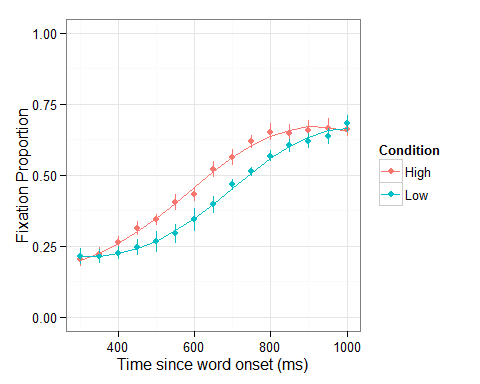

Quasi-logistic GCA
------------------

1.  finite data sets, granularity near boundaries (0 and 1)
2.  convergence etc.
3.  "Empirical" logit

True logistic models have a hard time handling 0 yesses `log(0)` or 0 nos `yesses / 0`.

The .5 correction in the empirical logit reflects the outcome of half a trial. It's smaller than the granularity of your data.

``` {.r}
# Weights are recommended for taking observation reliability into account
TargetFix <- mutate(TargetFix, 
                    elog = empirical_logit(sumFix, N - sumFix), 
                    wts = empirical_logit_weight(sumFix, N - sumFix))

# fit empirical logit model
m.elog <- lmer(elog ~ (ot1 + ot2 + ot3)*Condition +
                 (ot1 + ot2 + ot3 | Subject) +
                 (ot1 + ot2 + ot3 | Subject:Condition),
               data = TargetFix, weights = 1 / wts, REML = FALSE)
coef(summary(m.elog))
```

    ##                  Estimate Std. Error t value
    ## (Intercept)      -0.11322    0.06242 -1.8138
    ## ot1               2.72503    0.28383  9.6010
    ## ot2              -0.54486    0.16293 -3.3442
    ## ot3              -0.30251    0.10427 -2.9011
    ## ConditionLow     -0.24776    0.08634 -2.8696
    ## ot1:ConditionLow  0.03247    0.31485  0.1031
    ## ot2:ConditionLow  0.68888    0.22810  3.0201
    ## ot3:ConditionLow -0.08431    0.12683 -0.6647

``` {.r}
# parameter estimates are on same(ish) scale as logistic GCA
# plot model fit
ggplot(TargetFix, aes(Time, elog, color=Condition)) + 
  stat_summary(fun.data = mean_se, geom="pointrange") + 
  stat_summary(aes(y=fitted(m.elog)), fun.y = mean, geom="line") + 
  ylab("Fixation Empirical Log-Odds")
```

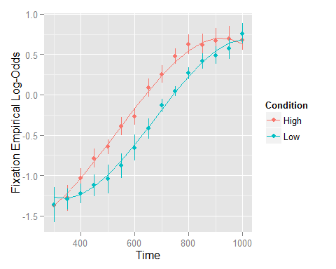

Visualizing higher-order polynomial terms
-----------------------------------------

One problem with using polynomials is that it can be hard to mentally visualize effects on the higher-order terms.

#### Example: function vs. thematic competition in VWP

``` {.r}
summary(FunctTheme)
```

    ##     Subject         Time         meanFix          Condition          Object   
    ##  21     :102   Min.   : 500   Min.   :0.0000   Function:765   Target    :510  
    ##  24     :102   1st Qu.: 700   1st Qu.:0.0625   Thematic:765   Competitor:510  
    ##  25     :102   Median : 900   Median :0.1333                  Unrelated :510  
    ##  27     :102   Mean   : 900   Mean   :0.2278                                  
    ##  28     :102   3rd Qu.:1100   3rd Qu.:0.3113                                  
    ##  40     :102   Max.   :1300   Max.   :1.0000                                  
    ##  (Other):918

``` {.r}
# Set core aesthetics and templates for next series of plots
p_base <- ggplot(FunctTheme, aes(Time, meanFix, color = Object, fill = Object)) + 
  facet_wrap(~ Condition) + 
  theme_bw(base_size = 10) + 
  labs(x = "Time Since Word Onset (ms)", y = "Fixation Proportion")
# Plot full data
p_func <- p_base + stat_summary(fun.y = mean, geom = "line") + 
  stat_summary(fun.data = mean_se, geom = "ribbon", color = NA, alpha = 0.3)
p_func
```

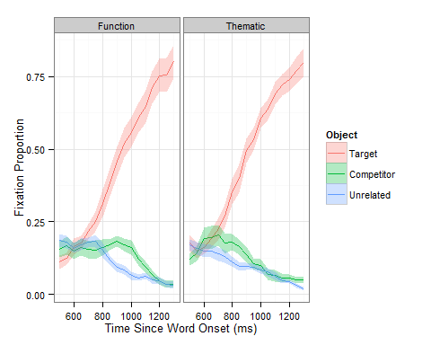

``` {.r}
# competition effects (use %+% to replace the data in a plot with a subset of
# the data)
p_func %+% subset(FunctTheme, Object != "Target") 
```

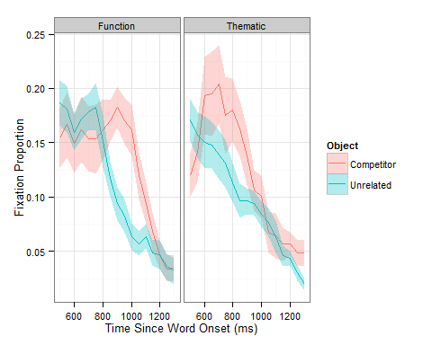

``` {.r}
# prep data for GCA
FunctTheme$timeBin <- (FunctTheme$Time / 50) - 9
FunctTheme <- merge(FunctTheme, orthogonal_time(FunctTheme, 4, "timeBin"))

# fit full model
m.ft<-lmer(meanFix ~ (ot1+ot2+ot3+ot4)*Object*Condition + 
             (1+ot1+ot2+ot3+ot4 | Subject) + 
             (1+ot1+ot2+ot3+ot4 | Subject:Object:Condition), 
           data=subset(FunctTheme, Object != "Target"), REML=F)
# look at parameter estimates
coefs.ft <- as.data.frame(coef(summary(m.ft)))
coefs.ft$p <- format.pval(2*(1-pnorm(abs(coefs.ft[,"t value"]))))
coefs.ft
```

    ##                                        Estimate Std. Error t value       p
    ## (Intercept)                            0.128415    0.01194 10.7532 < 2e-16
    ## ot1                                   -0.164199    0.04321 -3.7999 0.00014
    ## ot2                                   -0.109211    0.02270 -4.8120 1.5e-06
    ## ot3                                   -0.008451    0.02718 -0.3110 0.75583
    ## ot4                                    0.049537    0.01668  2.9691 0.00299
    ## ObjectUnrelated                       -0.019371    0.01208 -1.6030 0.10893
    ## ConditionThematic                     -0.007278    0.01208 -0.6023 0.54697
    ## ot1:ObjectUnrelated                   -0.062978    0.05476 -1.1500 0.25013
    ## ot2:ObjectUnrelated                    0.110951    0.03084  3.5975 0.00032
    ## ot3:ObjectUnrelated                    0.054413    0.03664  1.4852 0.13748
    ## ot4:ObjectUnrelated                   -0.060409    0.02339 -2.5828 0.00980
    ## ot1:ConditionThematic                 -0.025576    0.05476 -0.4670 0.64047
    ## ot2:ConditionThematic                  0.039281    0.03084  1.2736 0.20280
    ## ot3:ConditionThematic                  0.107392    0.03664  2.9313 0.00338
    ## ot4:ConditionThematic                 -0.067802    0.02339 -2.8988 0.00375
    ## ObjectUnrelated:ConditionThematic     -0.004164    0.01709 -0.2436 0.80751
    ## ot1:ObjectUnrelated:ConditionThematic  0.065878    0.07745  0.8506 0.39497
    ## ot2:ObjectUnrelated:ConditionThematic -0.047568    0.04362 -1.0906 0.27545
    ## ot3:ObjectUnrelated:ConditionThematic -0.156184    0.05181 -3.0145 0.00257
    ## ot4:ObjectUnrelated:ConditionThematic  0.075709    0.03308  2.2888 0.02209

``` {.r}
# critical effect only significant for ot3 and ot4

# check model fit

# combine observed data subset and model-fitted values
data.comp <- fortify(m.ft)
data.comp$Model <- "GCA_Full"

  
# Make plot. Replace data with data-plus-model-fits then layer on summary stats
p_fits <- p_base %+% data.comp + 
  stat_summary(fun.data = mean_se, geom = "pointrange") + 
  stat_summary(aes(y = .fitted), fun.y = mean, geom = "line")
p_fits
```

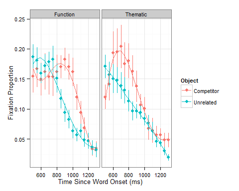

``` {.r}
# model fit looks pretty good, but do those ot3 and ot4 effects correspond to
# the early-late difference?

# we can try to answer that question by removing those effects from the model
# and visually comparing the model fit

# fit a reduced model
# for a statistical model comparison, we would only reduce the fixed effects
# for this visual comparison we need to reduce both the fixed and random effects
m.reduced <- lmer(meanFix ~ (ot1+ot2+ot3+ot4)*Object + (ot1+ot2+ot3+ot4)*Condition + 
                    (ot1+ot2)*Object*Condition + #remove ot3 and ot4 interactions from fixed effects
                    (ot1+ot2+ot3+ot4 | Subject) + 
                    (ot1+ot2 | Subject:Object:Condition), #also remove from random effects!
                  data=subset(FunctTheme, Object != "Target"), REML=FALSE)
# look at parameter estimates
coef(summary(m.reduced))
```

    ##                                        Estimate Std. Error t value
    ## (Intercept)                            0.128415    0.01194 10.7532
    ## ot1                                   -0.164199    0.04321 -3.7999
    ## ot2                                   -0.109211    0.02270 -4.8120
    ## ot3                                    0.030595    0.01621  1.8871
    ## ot4                                    0.030610    0.01166  2.6261
    ## ObjectUnrelated                       -0.019371    0.01203 -1.6104
    ## ConditionThematic                     -0.007278    0.01203 -0.6051
    ## ot1:ObjectUnrelated                   -0.062978    0.05363 -1.1742
    ## ot2:ObjectUnrelated                    0.110951    0.02962  3.7464
    ## ot3:ObjectUnrelated                   -0.023679    0.01202 -1.9694
    ## ot4:ObjectUnrelated                   -0.022555    0.01202 -1.8760
    ## ot1:ConditionThematic                 -0.025576    0.05363 -0.4769
    ## ot2:ConditionThematic                  0.039281    0.02962  1.3263
    ## ot3:ConditionThematic                  0.029300    0.01202  2.4369
    ## ot4:ConditionThematic                 -0.029947    0.01202 -2.4908
    ## ObjectUnrelated:ConditionThematic     -0.004164    0.01701 -0.2448
    ## ot1:ObjectUnrelated:ConditionThematic  0.065878    0.07585  0.8685
    ## ot2:ObjectUnrelated:ConditionThematic -0.047568    0.04188 -1.1357

``` {.r}
# add reduced-model-fitted values to data frame
data.comp2 <- fortify(m.reduced)
data.comp2$Model <- "GCA_Reduced"
data.comp <- rbind(data.comp, data.comp2)

# Update the previous plots
p_fits %+% data.comp + aes(linetype = Model)
```

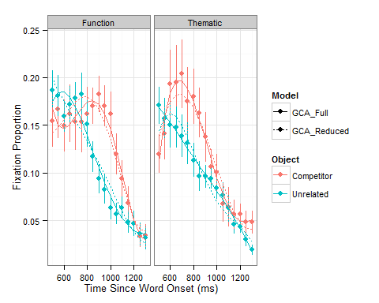

``` {.r}
# sort of looks like Function competition effect is earlier in reduced model and
# Thematic competition effect is later. Meh, kind of hard to see what is going
# on.

# compute competition effect size (Comp - Unrel) so we have half as much to plot
ES <- ddply(data.comp, .(Subject, Time, Condition, Model), summarize,
      Competition = meanFix[Object=="Competitor"] - meanFix[Object=="Unrelated"],
      .fitted = .fitted[Object=="Competitor"] - .fitted[Object=="Unrelated"])
#plot effect size time course
ggplot(ES, aes(Time, Competition, color=Condition, linetype = Model)) + 
  stat_summary(fun.y=mean, geom="point") + 
  stat_summary(aes(y=.fitted), fun.y=mean, geom="line") + 
  stat_summary(aes(y=.fitted), fun.y=mean, geom="line", linetype="dashed") + 
  theme_bw(base_size=10) + labs(x="Time Since Word Onset (ms)", y="Competition") + 
  theme(legend.justification=c(1,1), legend.position=c(1,1), legend.background=element_rect(color="black", fill="white"))
```

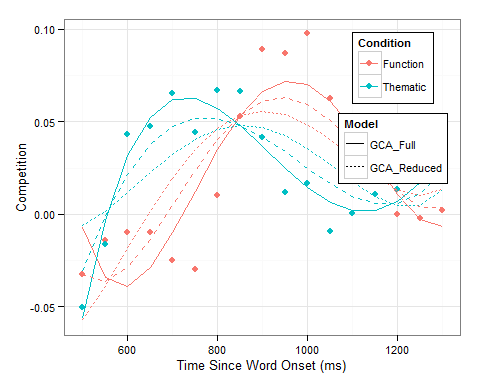

``` {.r}
#now can see that solid lines pull apart the time course, but the dashed lines are almost the same
#that is, the full model (with ot3:Object:Condition and ot4:Object:Condition) captured the time course difference, but the reduced model did not
```

Exercise 4
----------

``` {.r}
# Exercise 4: Re-analyze the word learning data (WordLearnEx) using logistic and quasi-logistic GCA
#  You'll need to convert the accuracy proportions to counts of correct and incorrect responses. To do that you need to know that there were 6 trials per block.
#  Compare the linear, logistic, and quasi-logistic (empirical logit) GCA results: are there any differences? If so, what are they and what do they mean?
#  Plot the model fits for each analysis
```

Exercise 5
----------

``` {.r}
# Exercise 5: using the TargetFix data, make plots showing the effects of Condition on each of the time terms (intercept, linear, quadratic and cubic)
```

Individual Differences
----------------------

-   Individual differences provide an additional level of analysis for understanding phenomena.
-   At a group level, a treatment works better than a placebo, but why does it work better for some people than for others?
-   People solve easy problems faster than hard problems, but why are some people a lot faster on the easy problems and other people only a little faster?
-   *t*-tests and ANOVA methods treat individual differences as noise.

From the book:

> Traditional analyses like *t*-tests and ANOVA assume random variation among individual participants and stop there, limiting theories to describing a hypothetical prototypical individual. However, we can ask a deeper question: what is the source of this variability among individuals? This is an important question because individual differences provide unique constraints on our theories. Insofar as individuals differ from that prototype, this tells us something about how the system (cognitive, psychological, behavioral, neural, etc.) is organized. A good theory should not just account for the overall average behavior of a system, but also for the ways in which the system’s behavior varies. For example, a good theory of human language processing should not only account for how typical college students process language, but also how language processing develops from infancy through adulthood into old age and how it breaks down, both in developmental and acquired disorders. All of this variability is not random—it is structured by the nature of the system—but we can’t understand that structure unless we can quantify individual differences. Traditional data analysis methods like *t*-tests and ANOVAs do not provide a method for doing this. (Mirman, 2014, p. 8)

Multilevel regression provides two ways to quantify and analyze individual differences.

### "External" individual differences

These differences can be added as fixed effects. Think of level-two, between-subjects variables: age, working memory span, severity of impairment.

#### Example: an aphasia treatment study aimed at improving picture naming

``` {.r}
summary(NamingRecovery)
```

    ##    SubjectID       Diagnosis     TestTime      MPO           Count    
    ##  LD0004 : 5   Anomic    :30   Min.   :0   Min.   :34.0   Min.   :175  
    ##  LD0021 : 5   Conduction:45   1st Qu.:1   1st Qu.:48.0   1st Qu.:175  
    ##  LD0025 : 5   Wernicke  :40   Median :2   Median :63.0   Median :175  
    ##  LD0031 : 5                   Mean   :2   Mean   :60.7   Mean   :175  
    ##  LD0043 : 5                   3rd Qu.:3   3rd Qu.:73.5   3rd Qu.:175  
    ##  LD0046 : 5                   Max.   :4   Max.   :80.0   Max.   :175  
    ##  (Other):85                                                           
    ##     Correct       Semantic.error    Mixed.error       Formal.error   
    ##  Min.   :0.0227   Min.   :0.0000   Min.   :0.00000   Min.   :0.0000  
    ##  1st Qu.:0.4136   1st Qu.:0.0146   1st Qu.:0.00695   1st Qu.:0.0174  
    ##  Median :0.7278   Median :0.0235   Median :0.01790   Median :0.0578  
    ##  Mean   :0.6310   Mean   :0.0354   Mean   :0.02215   Mean   :0.0881  
    ##  3rd Qu.:0.8850   3rd Qu.:0.0492   3rd Qu.:0.02940   3rd Qu.:0.1383  
    ##  Max.   :0.9942   Max.   :0.2000   Max.   :0.08780   Max.   :0.3778  
    ##                                                                      
    ##  Unrelated.error  Nonword.error   
    ##  Min.   :0.0000   Min.   :0.0000  
    ##  1st Qu.:0.0000   1st Qu.:0.0495  
    ##  Median :0.0060   Median :0.1279  
    ##  Mean   :0.0606   Mean   :0.1627  
    ##  3rd Qu.:0.0656   3rd Qu.:0.2247  
    ##  Max.   :0.3540   Max.   :0.6518  
    ## 

Let's just look at semantic errors.

``` {.r}
p_base <- ggplot(NamingRecovery, aes(TestTime, Semantic.error)) + 
  labs(x = "Test Number", y = "Semantic Errors (Proportion)") + 
  theme_bw(base_size = 12) + expand_limits(y = c(0, 0.1)) +
  stat_summary(fun.y = mean, geom = "point", size = 3) +
  stat_summary(fun.data = mean_se, geom = "errorbar", width = 0.2)

p_base + stat_summary(fun.y = mean, geom = "line")
```

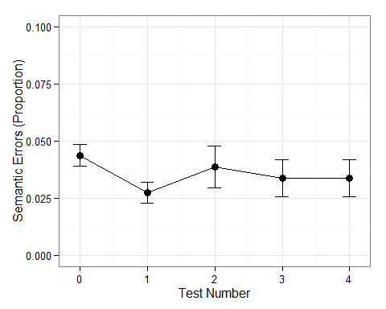

Is decrease modulated by how long it has been since the stroke(months post-onset)? Looks like it is:

``` {.r}
m.sem <- lmer(Semantic.error ~ TestTime*MPO + (TestTime | SubjectID), 
              data = NamingRecovery, REML = FALSE)
summary(m.sem)
```

    ## Linear mixed model fit by maximum likelihood  ['lmerMod']
    ## Formula: Semantic.error ~ TestTime * MPO + (TestTime | SubjectID)
    ##    Data: NamingRecovery
    ## 
    ##      AIC      BIC   logLik deviance df.resid 
    ##     -522     -500      269     -538      107 
    ## 
    ## Scaled residuals: 
    ##    Min     1Q Median     3Q    Max 
    ## -2.445 -0.547 -0.142  0.477  3.716 
    ## 
    ## Random effects:
    ##  Groups    Name        Variance Std.Dev. Corr
    ##  SubjectID (Intercept) 1.79e-04 0.01339      
    ##            TestTime    4.42e-05 0.00665  1.00
    ##  Residual              3.24e-04 0.01801      
    ## Number of obs: 115, groups: SubjectID, 23
    ## 
    ## Fixed effects:
    ##               Estimate Std. Error t value
    ## (Intercept)   0.063667   0.016473    3.86
    ## TestTime     -0.022907   0.007795   -2.94
    ## MPO          -0.000420   0.000267   -1.58
    ## TestTime:MPO  0.000353   0.000123    2.87
    ## 
    ## Correlation of Fixed Effects:
    ##             (Intr) TestTm MPO   
    ## TestTime     0.130              
    ## MPO         -0.970 -0.133       
    ## TestTim:MPO -0.113 -0.972  0.124

Visualizing three continuous variables is a little tricky, so let's split up `MPO`.

``` {.r}
# a simple median split
median_split <- function(xs) factor(xs >= median(xs), labels = c("Low", "High"))
NamingRecovery$MPO2 <- median_split(NamingRecovery$MPO)
# tertile split
tertile_split <- function(xs) {
  b <- quantile(xs, probs = (0:3) / 3) 
  cut(xs, breaks = b, include.lowest = TRUE, 
      labels = c("Low", "Medium", "High"))
}
NamingRecovery$MPO3 <- tertile_split(NamingRecovery$MPO)
# Use updated date-frame with  model fits
p_fit <- p_base %+% NamingRecovery + 
  stat_summary(aes(y = fitted(m.sem)), fun.y = mean, geom = "line")
p_fit
```

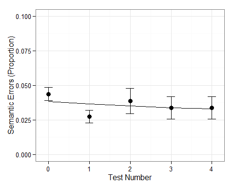

``` {.r}
# Now update color mapping to splits
p_fit + aes(color = MPO2) 
```

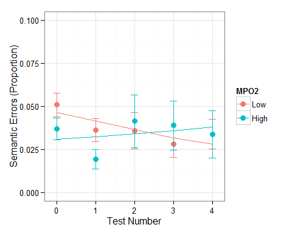

``` {.r}
p_fit + aes(color = MPO3)
```

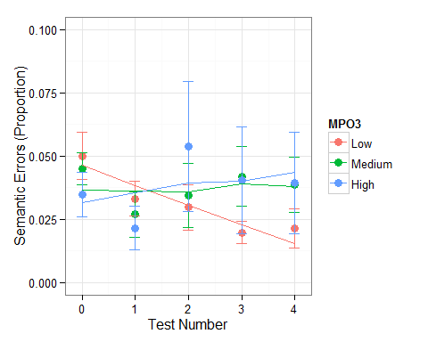

### "Internal" individual differences

"Internal" individual differences don't have a measure that can be entered as a fixed effect or individual differences might be needed for a different analysis (e.g., VLSM).

For such situations, random effects (basically, level-2 residuals) provide a way to quantify individual effect sizes in the context of a model of overall group performance.

#### Example: function and thematic knowledge following stroke.

Data: Function and Thematic competition for 17 LH stroke patients
=================================================================

``` {.r}
summary(FunctThemePts)
```

    ##       subj         Condition           Object          Time          timeBin  
    ##  206    : 486   Function:4113   Target    :2733   Min.   :-1000   Min.   : 0  
    ##  281    : 486   Thematic:4086   Competitor:2733   1st Qu.:    0   1st Qu.:20  
    ##  419    : 486                   Unrelated :2733   Median : 1000   Median :40  
    ##  1088   : 486                                     Mean   : 1000   Mean   :40  
    ##  1238   : 486                                     3rd Qu.: 2000   3rd Qu.:60  
    ##  1392   : 486                                     Max.   : 3000   Max.   :80  
    ##  (Other):5283                                                                 
    ##     meanFix           sumFix            N       
    ##  Min.   :0.0000   Min.   : 0.00   Min.   :12.0  
    ##  1st Qu.:0.0312   1st Qu.: 1.00   1st Qu.:15.0  
    ##  Median :0.1250   Median : 2.00   Median :16.0  
    ##  Mean   :0.1777   Mean   : 3.26   Mean   :15.4  
    ##  3rd Qu.:0.2500   3rd Qu.: 5.00   3rd Qu.:16.0  
    ##  Max.   :1.0000   Max.   :16.00   Max.   :16.0  
    ## 

``` {.r}
ggplot(subset(FunctThemePts, Time >= 0 & Time <= 2200 & Object != "Target")) + 
  aes(Time, meanFix, linetype = Object) + 
  facet_wrap(~ Condition, ncol = 1) + 
  stat_summary(fun.y = mean, geom = "line") + 
  stat_summary(fun.data = mean_se, geom = "ribbon", color = NA, alpha = 0.3, fill = "gray") + 
  geom_vline(xintercept = c(500, 2000)) + 
  labs(x="Time since word onset (ms)", y="Fixation Proportion") + 
  theme_bw(base_size = 12)
```

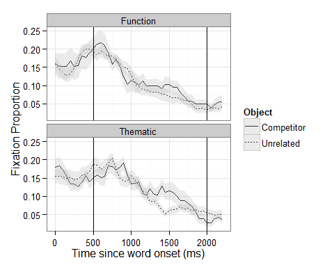

**Question:** Is there a correlation between Function and Thematic competition across patients?

``` {.r}
# prep data for GCA
FunctThemePts.gca <- subset(FunctThemePts, Time >= 500 & Time <= 2000 & 
                              Object != "Target")
summary(FunctThemePts.gca)
```

    ##       subj         Condition           Object          Time         timeBin  
    ##  206    : 124   Function:1054   Target    :   0   Min.   : 500   Min.   :30  
    ##  281    : 124   Thematic:1054   Competitor:1054   1st Qu.: 850   1st Qu.:37  
    ##  419    : 124                   Unrelated :1054   Median :1250   Median :45  
    ##  2221   : 124                                     Mean   :1250   Mean   :45  
    ##  1088   : 124                                     3rd Qu.:1650   3rd Qu.:53  
    ##  1238   : 124                                     Max.   :2000   Max.   :60  
    ##  (Other):1364                                                                
    ##     meanFix           sumFix            N       
    ##  Min.   :0.0000   Min.   : 0.00   Min.   :12.0  
    ##  1st Qu.:0.0625   1st Qu.: 1.00   1st Qu.:15.0  
    ##  Median :0.1000   Median : 2.00   Median :16.0  
    ##  Mean   :0.1119   Mean   : 2.56   Mean   :15.4  
    ##  3rd Qu.:0.1667   3rd Qu.: 4.00   3rd Qu.:16.0  
    ##  Max.   :0.5000   Max.   :12.00   Max.   :16.0  
    ## 

``` {.r}
FunctThemePts.gca$timeBin <- FunctThemePts.gca$timeBin - 29
otimes <- orthogonal_time(FunctThemePts.gca, 4, "timeBin")
FunctThemePts.gca <- merge(FunctThemePts.gca, otimes)

# fit full models
just_functions <- subset(FunctThemePts.gca, Condition == "Function")
just_thematics <- subset(FunctThemePts.gca, Condition == "Thematic")
m.funct <- lmer(meanFix ~ (ot1 + ot2 + ot3 + ot4)*Object +
                  (ot1 + ot2 + ot3 + ot4 | subj) + (ot1 + ot2 | subj:Object),
                data = just_functions, REML = FALSE)
m.theme <- update(m.funct, data = just_thematics)
coef(summary(m.theme))
```

    ##                      Estimate Std. Error t value
    ## (Intercept)          0.118839   0.009604 12.3739
    ## ot1                 -0.221320   0.041506 -5.3322
    ## ot2                 -0.052547   0.028872 -1.8200
    ## ot3                  0.007004   0.015698  0.4461
    ## ot4                 -0.054991   0.019144 -2.8725
    ## ObjectUnrelated     -0.007935   0.010295 -0.7707
    ## ot1:ObjectUnrelated -0.043758   0.055787 -0.7844
    ## ot2:ObjectUnrelated  0.108535   0.036858  2.9447
    ## ot3:ObjectUnrelated  0.044871   0.015922  2.8183
    ## ot4:ObjectUnrelated  0.022239   0.015922  1.3968

``` {.r}
# let's remind ourselves what random effects look like
str(ranef(m.funct), vec.len = 2)
```

    ## List of 2
    ##  $ subj:Object:'data.frame': 34 obs. of  3 variables:
    ##   ..$ (Intercept): num [1:34] -0.0327 0.0254 ...
    ##   ..$ ot1        : num [1:34] 0.0339 0.0726 ...
    ##   ..$ ot2        : num [1:34] -0.1538 0.0143 ...
    ##  $ subj       :'data.frame': 17 obs. of  5 variables:
    ##   ..$ (Intercept): num [1:17] 0.025 -0.0134 ...
    ##   ..$ ot1        : num [1:17] 0.0924 -0.0454 ...
    ##   ..$ ot2        : num [1:17] -0.1915 0.0375 ...
    ##   ..$ ot3        : num [1:17] 0.1124 -0.0677 ...
    ##   ..$ ot4        : num [1:17] 0.0386 0.0474 ...
    ##  - attr(*, "class")= chr "ranef.mer"

``` {.r}
head(ranef(m.funct)[["subj:Object"]])
```

    ##                (Intercept)      ot1       ot2
    ## 206:Competitor  -0.0327462  0.03386 -0.153810
    ## 206:Unrelated    0.0253877  0.07261  0.014312
    ## 281:Competitor   0.0066499 -0.04395 -0.059606
    ## 281:Unrelated   -0.0200311 -0.05530  0.115819
    ## 419:Competitor  -0.0006385  0.24667 -0.001246
    ## 419:Unrelated   -0.0092935 -0.15294  0.056835

``` {.r}
#those row names are handy, let's pull them into the data frame
#   use colsplit (from reshape2) to divide the row names using the : as a separator
re.id <- colsplit(row.names(ranef(m.funct)[["subj:Object"]]), ":", c("Subject", "Object"))
#combine the row names with the random effect estimates
re.funct <- data.frame(re.id, ranef(m.funct)[["subj:Object"]])
head(re.funct)
```

    ##                Subject     Object X.Intercept.      ot1       ot2
    ## 206:Competitor     206 Competitor   -0.0327462  0.03386 -0.153810
    ## 206:Unrelated      206  Unrelated    0.0253877  0.07261  0.014312
    ## 281:Competitor     281 Competitor    0.0066499 -0.04395 -0.059606
    ## 281:Unrelated      281  Unrelated   -0.0200311 -0.05530  0.115819
    ## 419:Competitor     419 Competitor   -0.0006385  0.24667 -0.001246
    ## 419:Unrelated      419  Unrelated   -0.0092935 -0.15294  0.056835

``` {.r}
# compute individual effect size as random effects difference between the two
# Conditions for each Subject for Intercept and Linear time term
ES.funct <- ddply(re.funct, .(Subject), summarize,
                  Function_Intercept = X.Intercept.[Object=="Competitor"] - X.Intercept.[Object=="Unrelated"], 
                  Function_Linear = ot1[Object=="Competitor"] - ot1[Object=="Unrelated"])
#same steps for thematic condition
re.theme <- data.frame(colsplit(row.names(ranef(m.theme)$"subj:Object"), ":", c("Subject", "Object")), 
                       ranef(m.theme)$"subj:Object")
ES.theme <- ddply(re.theme, .(Subject), summarize,
                  Thematic_Intercept = X.Intercept.[Object=="Competitor"] - X.Intercept.[Object=="Unrelated"],
                  Thematic_Linear = ot1[Object=="Competitor"] - ot1[Object=="Unrelated"])
#combine condition effect sizes
ES <- merge(ES.funct, ES.theme)
head(ES)
```

    ##   Subject Function_Intercept Function_Linear Thematic_Intercept Thematic_Linear
    ## 1     206          -0.058134        -0.03875           0.030963       -0.152879
    ## 2     281           0.026681         0.01135           0.015367        0.003994
    ## 3     419           0.008655         0.39961          -0.001865       -0.145997
    ## 4    1088          -0.003283        -0.15628          -0.084598       -0.061909
    ## 5    1238          -0.013349        -0.13986          -0.022051       -0.015554
    ## 6    1392          -0.003196         0.19123           0.061526       -0.353137

``` {.r}
#explain these numbers...
#now can compute correlations between effect sizes
cor.test(ES$Function_Intercept, ES$Thematic_Intercept)
```

    ## 
    ##  Pearson's product-moment correlation
    ## 
    ## data:  ES$Function_Intercept and ES$Thematic_Intercept
    ## t = -2.36, df = 15, p-value = 0.03223
    ## alternative hypothesis: true correlation is not equal to 0
    ## 95 percent confidence interval:
    ##  -0.8007 -0.0530
    ## sample estimates:
    ##     cor 
    ## -0.5204

``` {.r}
cor.test(ES$Function_Linear, ES$Thematic_Linear)
```

    ## 
    ##  Pearson's product-moment correlation
    ## 
    ## data:  ES$Function_Linear and ES$Thematic_Linear
    ## t = -3.357, df = 15, p-value = 0.004322
    ## alternative hypothesis: true correlation is not equal to 0
    ## 95 percent confidence interval:
    ##  -0.8637 -0.2545
    ## sample estimates:
    ##    cor 
    ## -0.655

``` {.r}
#both are significant negative correlations
#make two-panel scatterplot
#   first, re-arrange data
ES.m <- melt(ES, id="Subject")
ES.m <- cbind(ES.m, colsplit(ES.m$variable, "_", c("Condition", "Term")))
ES.c <- dcast(ES.m, Subject + Term ~ Condition)
head(ES.c)
```

    ##   Subject      Term  Function  Thematic
    ## 1     206 Intercept -0.058134  0.030963
    ## 2     206    Linear -0.038755 -0.152879
    ## 3     281 Intercept  0.026681  0.015367
    ## 4     281    Linear  0.011349  0.003994
    ## 5     419 Intercept  0.008655 -0.001865
    ## 6     419    Linear  0.399613 -0.145997

``` {.r}
ggplot(ES.c, aes(Function, Thematic)) + facet_wrap(~ Term, scales="free") + geom_point()
```

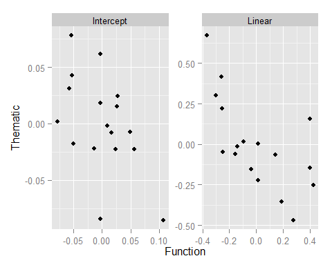

Why bother with the model-fitting when you could just take the difference of the observed data to get effect sizes?

-   Because that would *over*-estimate the individual differences.
-   Stein's paradox (Efron & Morris, 1977): re-visit QB example. Stein combined individual batting average and MLB grand mean batting average and variability to estimate of final batting average.

Return of the shrinkage: group and individual models have the same mean effect size (the group's overall mean effect size), but the range is much wider for Individual-based effect size estimates. Why? Individual model assigns all of the individual effect size to that individual.

Group (multilevel) model estimates a mean group effect, individual differences from that mean, and noise. This means that the estimate of the individual effect size is informed by (a) a model of the performance of the group of which this individual is a member and (b) the fact that some of the observed individual difference is just random noise. This "shrinks" the individual effect size estimate toward the group mean in proportion to the model's cetainty about that mean and estimate of the noisiness of the data.

Reporiting GCA results
----------------------

General principle: provide enough information that another researcher would be able to replicate your analysis.

1.  Model structure: clearly describe the functional form, all of the fixed effects (may want to include contrast coding for factors and scale for continuous predictors), and the random effects structure.
2.  Basis for the inferential statistics: which models were compared? how were parameter-specific p-values estimated?
3.  Complete model results, not just *p*-values: For model comparisons, report the change in log-likelihood and the degrees of freedom (i.e., the chi-squared test). For parameter estimates, report the estimates and their standard errors (the *t*-values are optional because they are just the estimates divided by standard errors).

### Example

For the `WordLearnEx` data:

> Growth curve analysis (Mirman, 2014) was used to analyze the learning of the novel words over the course of 10 training blocks. The overall learning curves were modeled with second-order orthogonal polynomials and fixed effects of TP on all time terms. The low TP condition was treated as the baseline and parameters were estimated for the high TP condition. The model also included random effects of participants on all time terms. The fixed effects of TP were added individually and their effects on model fit were evaluated using model comparisons. Improvements in model fit were evaluated using -2 times the change in log-likelihood, which is distributed as chi-squared with degrees of freedom equal to the number of parameters added. All analyses were carried out in R version 3.1 using the `lme4` package (version 1.1-6).
>
> The effect of TP on the intercept did not improve model fit (χ<sup>2</sup>(1) = 1.55; *p* = 0.213), nor did the effect of TP on the linear term (χ<sup>2</sup>(1) = 0.358; *p* = 0.55). The effect of TP on the quadratic term, however, did improve model fit (χ<sup>2</sup>(1) = 5.95; *p* = 0.0147), indicating that the low and high TP conditions differed in the rate of word learning. Table 1 shows the fixed effect parameter estimates and their standard errors along with *p*-values estimated using the normal approximation for the *t*-values.

``` {.r}
##########################
# ANALYSIS TIME
# try GCA on your own data, ask for help if you need it
# if you don't have any appropriate data on hand, try one (or more) of these exercises:
#
# Exercise 6: individual differences in cohort and rhyme competition
# The CohortRhyme data set contains data from an eye-tracking experiment (Mirman et al., 2011) that investigated phonological competition between cohorts (e.g., penny - pencil) and rhymes (e.g., carrot - parrot). Three groups of participants were tested: 5 Broca's aphasics, three Wernicke's aphasics, and 12 control participants.
#  (a) Make a multi-panel plot showing each kind of competition for each group  
#  (b) Use fourth-order orthogonal polynomials to analyze (separately) the cohort and rhyme competition effects. Do the diagnosis groups differ in competition effect sizes? 
#  (c) Use random effects to compute individual competition effect sizes (note: you'll need to use a model without any group fixed effects to get random effects relative to the overall sample rather than the diagnosis sub-group). Test correlations between cohort and rhyme competition effects for patients and controls. Make a multi-panel scatterplot showing these correlations.
##########################
```

* * * * *

``` {.r}
sessionInfo()
```

    ## R version 3.1.0 (2014-04-10)
    ## Platform: x86_64-w64-mingw32/x64 (64-bit)
    ## 
    ## locale:
    ## [1] LC_COLLATE=English_United States.1252  LC_CTYPE=English_United States.1252   
    ## [3] LC_MONETARY=English_United States.1252 LC_NUMERIC=C                          
    ## [5] LC_TIME=English_United States.1252    
    ## 
    ## attached base packages:
    ## [1] splines   stats     graphics  grDevices utils     datasets  methods   base     
    ## 
    ## other attached packages:
    ##  [1] rmarkdown_0.2.46  reshape2_1.4      multcomp_1.3-3    TH.data_1.0-3    
    ##  [5] survival_2.37-7   mvtnorm_0.9-99992 plyr_1.8.1        lme4_1.1-6       
    ##  [9] Rcpp_0.11.2       Matrix_1.1-3      ggplot2_1.0.0    
    ## 
    ## loaded via a namespace (and not attached):
    ##  [1] bitops_1.0-6        caTools_1.17        cluster_1.15.2      colorspace_1.2-4   
    ##  [5] digest_0.6.4        evaluate_0.5.5      formatR_0.10        Formula_1.1-1      
    ##  [9] gdata_2.13.3        gplots_2.13.0       grid_3.1.0          gtable_0.1.2       
    ## [13] gtools_3.4.1        Hmisc_3.14-4        htmltools_0.2.4     KernSmooth_2.23-12 
    ## [17] knitr_1.6           labeling_0.2        lattice_0.20-29     latticeExtra_0.6-26
    ## [21] lmerTest_2.0-6      MASS_7.3-31         minqa_1.2.3         munsell_0.4.2      
    ## [25] nlme_3.1-117        numDeriv_2012.9-1   pbkrtest_0.3-8      proto_0.3-10       
    ## [29] RColorBrewer_1.0-5  RcppEigen_0.3.2.1.2 sandwich_2.3-0      scales_0.2.4       
    ## [33] stargazer_5.1       stringr_0.6.2       tools_3.1.0         yaml_2.1.13        
    ## [37] zoo_1.7-11
